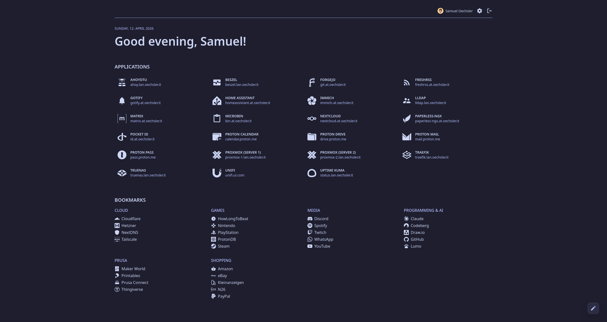

# Dash




A self-hosted, multi-user home-lab dashboard — inspired by [Flame](https://github.com/pawelmalak/flame), rebuilt for modern homelabs.

Sign in with your existing identity provider, get a personal dashboard with bookmarks and themes, and share application links with friends and family.

> [!WARNING]
> This project emerged from my personal homelab needs for a flexible multi-user dashboard. While the core features are production-ready and actively used in my daily workflow, the codebase is under active development as I continue to add features and refinements. Early adopters should note this experimental status and evaluate carefully before deploying in critical production environments.

## Highlights

- Multi-user with OAuth2/OIDC
- Per-user dashboards, bookmarks, and themes
- Shared application links with group-based visibility
- PostgreSQL backed, Docker image for amd64 and arm64

## Quick Start

```bashgit
cp docker/compose/dash.env.example docker/compose/dash.env
cp docker/compose/postgres.env.example docker/compose/postgres.env
# fill in both files

docker compose -f docker/compose/compose.yml up -d
```

## Identity Provider

Dash requires an OAuth2/OIDC identity provider. Any standard-compliant IdP works — the only hard requirement is that it emits a `groups` claim so Dash can distinguish regular users from admins.

**Recommended: [Pocket ID](https://pocket-id.org)**

Pocket ID is a lightweight, self-hosted OIDC provider built for homelabs. It supports passkey login, has a clean admin UI, and is trivial to run alongside Dash. It is the IdP this project is tested against.

Once you have Pocket ID running and have created an OIDC client, set the following in `dash.env`:

```env
OIDC_ISSUER=https://id.yourdomain.com
OIDC_CLIENT_ID=<client-id-from-pocket-id>
OIDC_CLIENT_SECRET=<client-secret-from-pocket-id>
OIDC_REDIRECT_URL=https://dash.yourdomain.com/session/login/callback
OIDC_ADMIN_GROUP=admin
```

Any other OIDC-compliant provider works equally well — self-hosted options like Authentik, Keycloak, or Authelia, as well as social platforms like GitHub or Google (via an OAuth2 proxy that adds a `groups` claim).

## Images

Docker images are published to the registries of this repository:

- `:main` — current stable development state, updated on every push to `main`
- `:latest` — latest release
- `:vX.Y.Z` — immutable tag for each release, following semantic versioning

## Contributing

Contributions and pull requests are welcome!

## License

MIT — see [LICENSE](./LICENSE).
