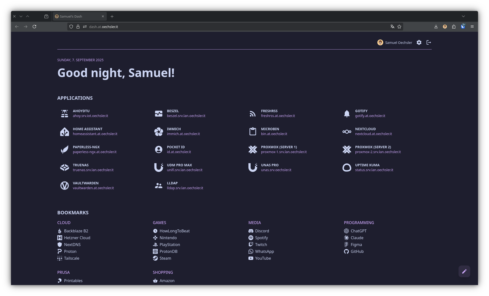

# Dash



A self‑hosted, multi‑user home‑lab dashboard.

Dash reimagines the popular [Flame](https://github.com/pawelmalak/flame) project for modern homelab needs.

## ✨ Highlights

- 🔐 Multi-user per default with OAuth2/OIDC
- 👤 Per-user dashboards (categories& bookmarks)
- 🔗 Homelab apps, visible to authorized users
- 🎛️ Personal settings & themes
- ⚡ Lightning fast Go backend with HTMX + templ
- 💾 Simple, file-based storage (SQLite) 
- 🐳 Easy Docker Compose deploy

## Quick Start

1. Clone the repository:
   ```bash
   git clone https://github.com/oechsler/dash.git
   cd dash
   ```

2. Configure the OAuth2 environment variables in `compose/compose.yml`:
    - `OAUTH2_ADMIN_GROUP`: Name of the admin group for authorization
    - `OAUTH2_PROFILE_URL`: URL for user profile information
    - `OAUTH2_END_SESSION_URL`: URL for OAuth2 logout
    - `OAUTH2_PROXY_REDIRECT_URL`: OAuth2 callback URL
    - `OAUTH2_PROXY_WHITELIST_DOMAINS`: Allowed domains
    - `OAUTH2_PROXY_PROVIDER_DISPLAY_NAME`: Name of your OAuth provider
    - `OAUTH2_PROXY_OIDC_ISSUER_URL`: OpenID Connect issuer URL
    - `OAUTH2_PROXY_CLIENT_ID`: OAuth client ID
    - `OAUTH2_PROXY_CLIENT_SECRET`: OAuth client secret
    - `OAUTH2_PROXY_COOKIE_DOMAIN`: Cookie domain
    - `OAUTH2_PROXY_COOKIE_SECRET`: Random string for cookie encryption


3. Start the application:
   ```bash
   cd compose
   docker compose up -d
   ```

4. Access Dash at `http://localhost:8080`

## ⚠️ Project Status

This project emerged from my personal homelab needs for a flexible multi-user dashboard. While the core
features are production-ready and actively used in my daily workflow, the codebase is under active development as I
continue to add features and refinements. Early adopters should note this experimental status and evaluate carefully
before deploying in critical production environments.

## Contributing

Issues and PRs are welcome. Please keep changes small and focused. If adding a feature, include a short rationale and
usage notes.

## License

This project is licensed under the MIT License. See the [LICENSE](./LICENSE) file for details.
